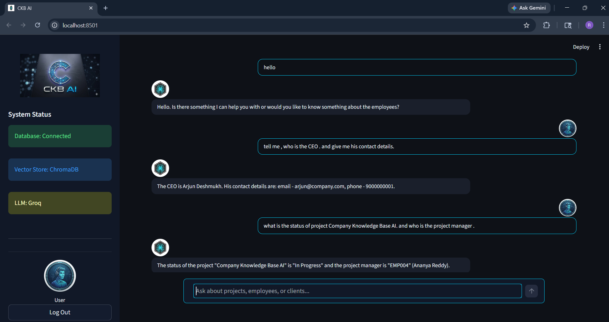

<<<<<<< HEAD
=======
# Company Knowledge Base AI using RAG

---

## 📌 Project Overview

The **Company Knowledge Base AI** is an intelligent system developed to enhance how organizations access, manage, and utilize internal data. The project is based on **Retrieval-Augmented Generation (RAG)**, which combines semantic search with advanced Large Language Models (LLMs) to deliver accurate and context-aware responses.

Traditional systems rely on keyword-based search, which often fails to provide relevant results. This project overcomes that limitation by enabling users to interact with company data using **natural language queries** through an AI-powered chatbot interface.

The system retrieves relevant information from a knowledge base and generates human-like responses, making it easier for employees to access organizational knowledge efficiently.

---

## 🧠 Architecture Diagram

---

## 🚀 Key Features

- Natural language-based query system  
- Semantic search using vector embeddings  
- Context-aware response generation  
- Fast inference using Groq LLM  
- Modular and scalable RAG architecture  
- Interactive chatbot UI using Streamlit  
- Integration with structured and unstructured data  

---

## 🧠 Technologies Used

- **LLM:** Groq  
- **Framework:** LangChain  
- **Vector Database:** ChromaDB  
- **Database:** MongoDB  
- **Embedding Model:** Hugging Face Transformers  
- **Frontend:** Streamlit  
- **Backend:** Python  

---

## ⚙️ System Workflow

The system follows a structured RAG pipeline:

1. User enters a query via the Streamlit interface  
2. Query is processed and converted into embeddings  
3. Embeddings are matched against stored vectors in ChromaDB  
4. Relevant documents are retrieved based on similarity  
5. Retrieved context is passed to the LLM (Groq) via LangChain  
6. LLM generates a natural language response  
7. Response is displayed to the user  

---

## 🏗️ Project Implementation Details

### 🔹 Data Layer

- MongoDB is used to store structured company data  
- Data includes employee records and organizational information  
- Acts as the primary source for building the knowledge base  

### 🔹 Embedding Generation

- Hugging Face transformer models are used  
- Converts text data into numerical vectors  
- Captures semantic meaning for better retrieval  

### 🔹 Vector Storage

- ChromaDB stores embeddings  
- Enables semantic similarity search  
- Improves retrieval accuracy over keyword search  

### 🔹 Retrieval Mechanism

- Retrieves top relevant documents  
- Based on vector similarity  
- Ensures context-aware information selection  

### 🔹 LLM Integration

- Groq is used for fast inference  
- Generates human-like responses  
- Integrated using LangChain pipeline  

### 🔹 Frontend Interface

- Built using Streamlit  
- Chatbot-style interaction  
- Displays responses dynamically  

---

---

## 💡 Use Cases

- Company internal knowledge systems  
- Employee information retrieval  
- HR automation tools  
- AI-powered enterprise assistants  
- Document-based Q&A systems  

---

## 📈 Future Enhancements

- Cloud deployment (AWS / Azure)  
- Real-time database syncing  
- Authentication & role-based access  
- Multi-user support  
- Conversation memory (chat history context)  
- Improved UI/UX design  

---

## 🎯 Project Outcome

The project successfully demonstrates how **RAG architecture** can be used to build intelligent enterprise systems. It improves data accessibility, reduces manual effort, and enhances decision-making by providing accurate and context-aware responses.

---

## 🔐 Environment Variables

To securely manage sensitive configuration details, this project uses a `.env` file.

### Step 1: Create `.env` File

In the root directory of the project, create a file named: .env

### Step 2: Add Required Variables

Open the `.env` file and add the following:

- GROQ_API_KEY=your_groq_api_key_here
- MONGO_URI=your_mongodb_connection_string
- MONGO_DB_NAME=your_database_name

### Important Notes

- Replace the placeholder values with your actual credentials  
- Do not share your `.env` file publicly  
- Add `.env` to your `.gitignore` file to keep it secure  
- Ensure MongoDB is running and accessible  

---

## ▶️ How to Run the Project

Follow these steps to run the project successfully:

### Step 1: Install Dependencies

pip install -r requirements.txt

### Step 2: Setup Environment Variables

Ensure your `.env` file is properly created and configured.

### Step 3: Run Backend (Data Processing & Vector Store)

python main.py

### Step 4: Run Frontend (Streamlit Application)

streamlit run app.py

### Step 5: Access the Application

- After running Streamlit, a local URL will appear in the terminal  
- Open the URL in your browser (usually http://localhost:8501)  
- Start interacting with the chatbot  

### Final Notes

- Run `main.py` at least once before starting the Streamlit app  
- Ensure MongoDB connection is correct  
- Verify your Groq API key is valid  
>>>>>>> cd0bdf8fe3d8e91b33d7887111b7e02987dfae98
